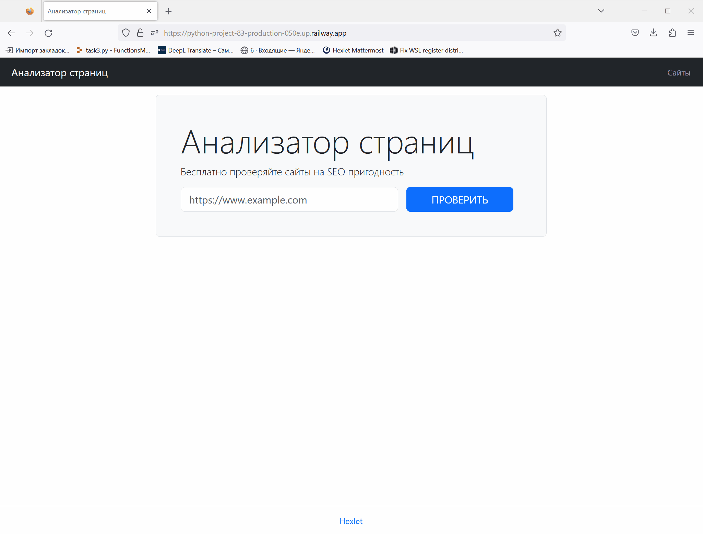

# Study project No. 3 'Page Analyzer'

[](https://github.com/KarinaAbd/python-project-83/actions)
[](https://github.com/KarinaAbd/python-project-83/actions/workflows/pyci.yaml)
[](https://codeclimate.com/github/KarinaAbd/python-project-83/maintainability)

try [Page Analyzer](https://python-project-83-production-050e.up.railway.app/) yourself
***



This repository was created as part of [a Hexlet study project](https://ru.hexlet.io/programs/python/projects/83). "Page Analyzer" is a a website that analyzes the web-pages for SEO suitability.

## How to install

```bash
git clone git@github.com:KarinaAbd/python-project-83.git
cd python-project-83/
# install poetry
make install
```

## How to develop
The project uses [a database PostrgreSQL](https://www.postgresql.org/), make sure it is installed on your computer and the database server is started. For further configuration, use the command ```make database```. Next, you can use the command ```make dev``` to launch the application on the localhost with active debugger or the command ```make start``` to deploy it on production.
